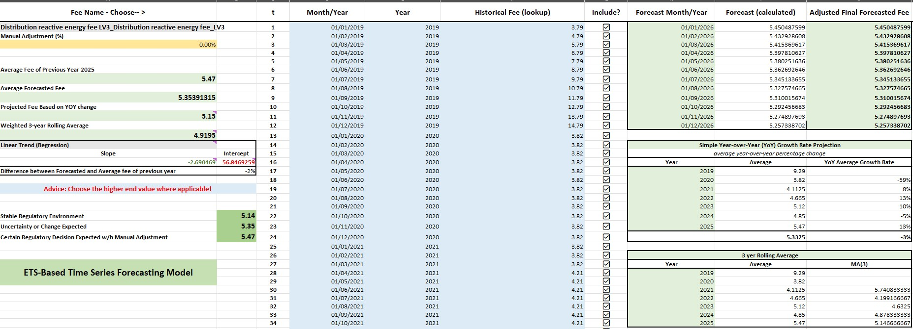
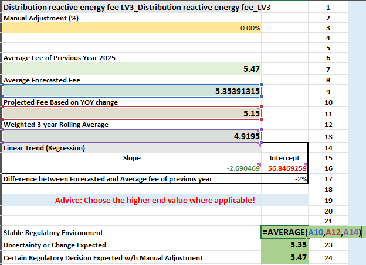
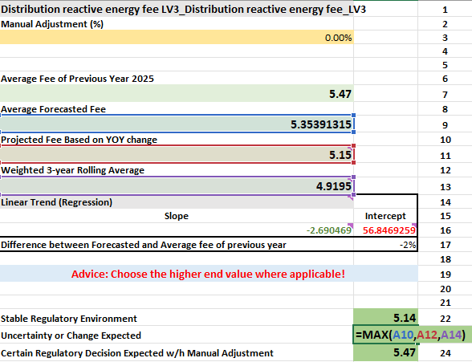
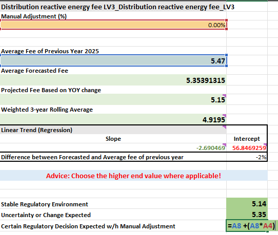
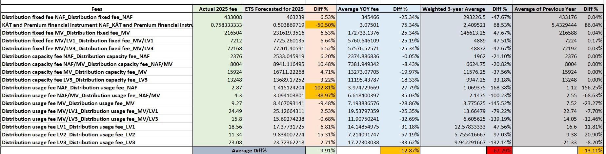

# 📊 ETS-Based Forecasting Framework for Administrative Energy Fees

> A fully documented Excel model built to forecast non-commodity energy fees using ETS, YoY growth, moving averages, and manual input — helping support internal decisions on next-year fee assumptions in regulated markets.

---

## 🔍 Purpose

This Excel model is more than a simple forecasting tool — it is a **decision support framework** that combines data-driven forecasting with domain knowledge to guide next-year planning for administrative fees such as **distribution, capacity, and reactive energy charges**.

The model uses Excel’s built-in `FORECAST.ETS` function but layers it with:
- Historical comparison (YoY, averages, regression)
- Error validation
- Scenario-based recommendations
- Manual override options

---

## 🧠 Use Case

Many regulatory cost elements in the energy sector (especially in European markets) are not market-driven but politically influenced, delayed, or smoothed over time. That makes forecasting particularly tricky.

This model was designed to:
- Forecast administrative fees (Non-commodity fees, reactive energy, etc.)
- Compare the ETS output against naïve methods
- Help users **choose an appropriate fee estimate** depending on regulatory clarity

---

## 📈 Core Forecast Logic

```excel
=IF(COUNT(F:F)=1, "",
    LET(
        HistDates, FILTER($D$2:$D$1000, ($F$2:$F$1000>0)),
        HistFees, FILTER($F$2:$F$1000, ($F$2:$F$1000>0)),
        IF(COUNTA(HistDates)<2, "",
            FORECAST.ETS(H2, HistFees, HistDates)
        )
    )
)
```

✅ Robust  
✅ Skips blanks/zeroes  
✅ Automatically adjusts with new monthly data  


---

## 🎛 Forecast Comparison Table

| Method                     | Used For                         |
|---------------------------|----------------------------------|
| **ETS Forecast**          | Primary projection               |
| **YOY Growth Rate**       | Trend-based sanity check         |
| **3-Year Rolling Average**| Smoothing historical anomalies   |
| **Linear Regression**     | Trendline reference              |
| **Manual Adjustment (%)** | Expert override capability       |



---

## 📋 Regulatory Decision Logic

The model includes built-in logic for selecting the final fee based on the expected regulatory environment.

| Scenario                                | Formula Used                       |
|----------------------------------------|------------------------------------|
| Stable Environment                     | `=AVERAGE(...)` across all methods |
| Uncertainty or Change Expected         | `=MAX(...)` of ETS, YoY, Avg       |
| Certain Regulation + Manual Adjustment | Weighted version with override     |





---

## 🧪 Backtesting the ETS Model

I validated the ETS approach against real historical 2025 fee outcomes. As shown below, ETS consistently outperformed YOY and 3-year averages — especially for volatile fees.



| Metric                     | Avg Error (%) |
|---------------------------|---------------|
| **ETS Forecast**          | -9.91%        |
| YOY Growth Avg            | -12.87%       |
| 3-Year Rolling Avg        | -67.29%       |
| Previous Year Copy        | -13.11%       |

---

## 📁 Files Included

| File Name                                | Description                                      |
|------------------------------------------|--------------------------------------------------|
| `Non-commodity ETS Forecasting Model.xlsx` | Annotated forecasting framework                 |
| `media/*.png`                             | Screenshots for key views and model logic       |

---

## 🚀 Future Enhancements

- Add dropdown to switch between multiple fee series
- Integrate confidence intervals around ETS forecasts
- Automate chart generation from forecast output
- Explore Python implementation with Prophet or statsmodels

---

## 📌 Attribution

This project was built to improve internal decision-making around energy fee forecasting. While ETS is an existing Excel function, I structured and validated this model from scratch — including framework logic, business integration, and fallback rules — to improve planning accuracy and internal credibility.

> 📬 Reach out if you want to adapt this logic for other energy or regulated pricing domains.
